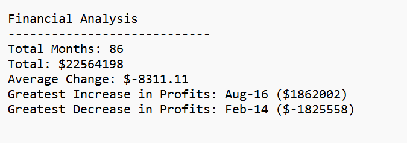
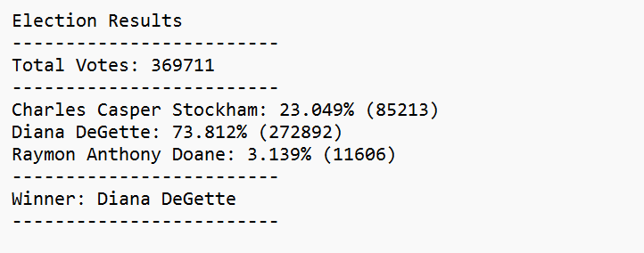

# python-challenge

## Purpose of Project
In this assignment, you'll complete two challenges in which you'll apply your new Python skills.
This assignment is applying conceets that I learned in Python unit.
### PyBank
In this challenge, you are tasked with creating a Python script to analyze the financial records of your company. You will give a set of financial data called budget_data.csv. The dataset is composed of two columns: "Date" and "Profit/Losses". (Thankfully, your company has rather lax standards for accounting, so the records are simple.)
Your task is to create a Python script that analyzes the records to calculate each of the following:
-The total number of months included in the dataset
-The net total amount of "Profit/Losses" over the entire period
-The changes in "Profit/Losses" over the entire period, and then the average of those changes
-The greatest increase in profits (date and amount) over the entire period
-The greatest decrease in profits (date and amount) over the entire period

The purpose of this challenge is to develop a Phython script that can be use to analyze the financial records. For this challenge, I need to find total number of months, net total amount of profit/loss, changes in profit/losses and its average, maximum profit and minimum profits over entire period of time. 

### PyPoll
In this challenge, you are tasked with helping a small, rural town modernize its vote counting process.
You will be given a set of poll data called election_data.csv. The dataset is composed of three columns: "Voter ID", "County", and "Candidate". Your task is to create a Python script that analyzes the votes and calculates each of the following:
-The total number of votes cast
-A complete list of candidates who received votes
-The percentage of votes each candidate won
-The total number of votes each candidate won
-The winner of the election based on popular vote.

The purpose of this challenge is to develop a Python script that is useful to find out the various vote results on election.
For this challenge, I need to find out the total number of votes, a list of candidates who received votes, the percentage of votes each candidate won, the total number of votes each candidate won, and the winner of the election. 

## Analysis 

### PyBank
In this challenge we created <a href="PyBank/main.py">code</a> to find profit/loss change that was programmed by Phython script. 

### PyPoll
In this challenge we created <a href="PyPoll/main.py">code</a> to find the various results of the election.

## Results
In PyBank challenge, the total months of included in the dataset are 86 months. The net total amount of profit/ losses are $22,564,198. The average change in profit/losses are $-8,311.11. The greatest increase in profits was in Aug-16 with an amount of $1,862,002 and the greatest decrease in profits was in Feb-14 with an amount of $-1,825,558.

In PyPoll challenge, the total number of votes are 369,711. Charles Casper Stockham won 23.049% (85213) votes, Diana DeGette won 73.812% (272892) votes, and Raymon Anthony Doane won 3.139% (11606)votes. From this, Diana DeGett won the election by 73.812% receiving majority votes. Raymond Anthony Doane received least votes. 

## Recommandation 
PyPoll challenge can be used to calculate all elections through out the US and local cities and PyBank challenge can be used in all company to find out the profit/losses. 

